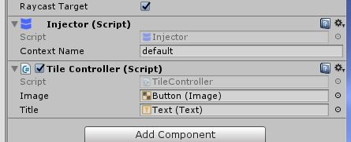
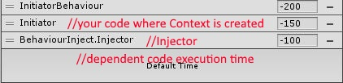
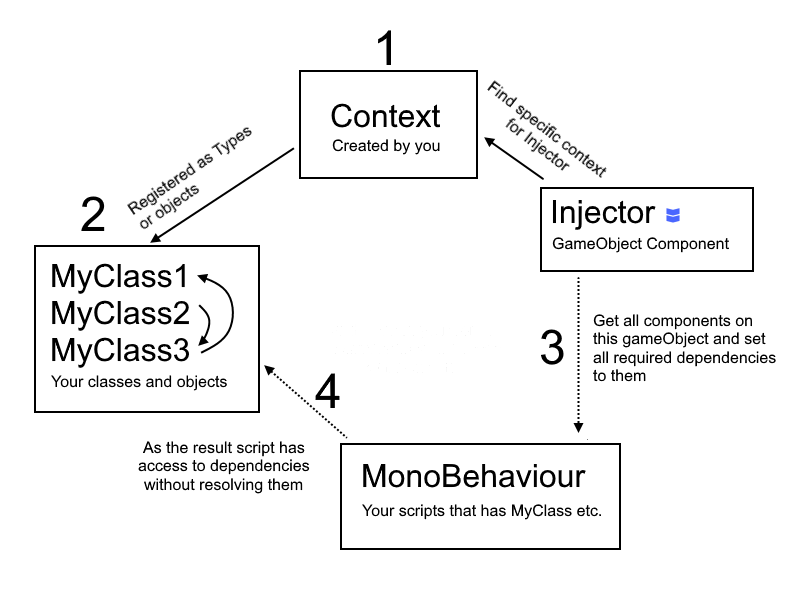

# BInject #
## Behaviour Inject for Unity3d ##

This is lightweight and easy to use inversion of control tool for Unity3d. There are few script files with approximately 400 lines of code. Yet it provides crutial features of reflective dependency injection:
- resolving interfaces;
- injection to MonoBehaviour properties, fields or methods;
- hierarchy autocomposition with constructor injection;
- factories;
- event injection;

### What is it for? ###
Average project eventually meets difficulties with myriads of links and connections between classes. Especially in Unity, where you have no strict composition root, MonoBehaviours in most cases has independent lifecycles and you have to use either singletons or "FindObjectsOfType" stuff to connect things to each other creating mess of links and mutual dependencies. Code comes really hard to support and develop.

This is where Dependency Injection comes to help. You just define core classes and interfaces for you logic, mark required links with [Inject] and then DI does all the magic linking things to each other (with reflection). No headache with passing tons of instances through composition tree, uncontrollable dirty singletons or creating all-mighty God-objects that owns and controls everything. Classes should know only things that they really need. You are free to separate, encapsulate, create interfaces, use polymorphism and have full conrol over links in your logic in simple and elegant way.

BehaviourInject is done for Unit3d to preserve familiar pipeline. It allows injections into MonoBehaviours without direct resolving. You shouldn't change the way you creating scene or instancing prefabs, almost everything will work in the same way, but requested dependencies will be there with no effort!
<a id="table"></a>
* <a href="#howto">How to</a>
* <a href="#multiple">Multiple contexts</a>
* <a href="#interface">Interfaces</a>
* <a href="#autocompose">Autocomposition</a>
* <a href="#factories">Factories</a>
* <a href="#events">Events</a>
* <a href="#commands">Commands</a>
* <a href="#go-context">GameObject context</a>

## <a id="howto"></a> How to

For most cases you will need only three entities:

* Context class
* Injector behaviour
* [Inject] attribute

### Initialization ###

Use any of your behaviours to settle following code. Make shure that it awakes BEFORE other behaviours, where you want to inject properties, and Injector.

```csharp
void Awake(){
    MyDataModel model = new MyDataModel(); //Any of your dependencies
    Context context = Context.Create();
    context.RegisterDependency(model);
}
```

### Injection ###

Place 'Injector' at first place in the GameObject, adjacently to your dependent behaviours. "Context" dropdown defines what context you are now using. Thus you can use multiple contexts in your application.



In your MonoBehaviour mark dependency in this way:

```csharp
public class MyBehaviour : MonoBehaviour 
{
    [Inject]
    public MyDataModel Model { get; private set; }
    
    [Inject]
    public MyDataModel _model;
    
    [Inject]
    public void Init(One one, Two two, Three three)
    {
    	//most correct way to inject dependencies
    	...
    }
}
```

Voila! MyDataModel should be there after Awake of the Injector. Note that if you want to use dependencies in Awake method, you should guarantee that Injector awakes before your target behaviours (but still after behaviour where context is created). In best case execution order must be like this: ContextCreator => Injector => Your code. Consider using 'Script Execution Order' feature in Unity.



### Core concept ###

It all works just like this. Right after you've created Context it is added to global ContextRegistry. When Injector awakes it checks ContextRegistry for existing specified Context. Then it lists all current components on it's gameObject and in each component looks for [Inject]-marked fields, properties and setters. For each [Inject] member it resolves corresponding Type object from context and sets this object to member. In the end of that cycle, before all other scripts are awaken, they have their dependencies already in place, ready to operate.



## <a id="multiple"></a> Multiple contexts
<a href="#table">Back to contents</a>

If you need multiple contexts at once, you need to add it's name in *BInject/Resources/BInjectSettings* and provide that name in constructor 
```csharp 
Context.Create("my_context"); 
```
Then you should specify Injector to use this context by setting сorresponding context in inspector.
If no argument is passed context will be named "default".

You can not have multiple contexts with the same name at once.

You may create parent context that allow you to share dependencies between multiple contexts:

```csharp
Context.Create("my_context")
	.SetParentContext("base");
```
After this any dependency that won't be found in "my_context" context will be searched in "base".

It is also possible to destroy context (if it's logically bound to scene for example) simply by calling context.Destroy() method. **Important! Destroying context also followed by destruction of all child contexts and all gameObjects that has Injectors targeted to this context**.

## <a id="interface"></a> Interfaces
<a href="#table">Back to contents</a>

You can specify interface injection this way:

```csharp
public class InitiatorBehavour : MonoBehaviour
{
    void Awake(){
        var reader = new MockReader(); //implements IReader
        Context.Create()
		.RegisterDependencyAs<MockReader, IReader>(reader);
    }
}

public class MyBehaviour : MonoBehaviour 
{
    [Inject]
    public IReader Reader { get; private set; }
}
```

## <a id="autocompose"></a> Autocomposition
<a href="#table">Back to contents</a>

BehaviourInject supports simple object hierarchy construction. Thus you may provide to the context only types of wished objects. And then during injection BehaviourInject will automatically create this objects using constructor dependency injection.

```csharp
public class InitiatorBehavour : MonoBehaviour
{
    void Awake(){
        Settings settings = new Settings("127.9.1.1");
        Context context1 = Context.Create()
		.RegisterDependency(settings)
		.RegisterType<Core>()
		.RegisterType<Connection>()
		.RegisterTypeAs<MockReader, IReader>();
    }
}

public class MyBehaviour : MonoBehaviour 
{
    //connection is not created directly in your code. But constructed atomatically in Context;
    [Inject]
    public Connection Connector { get; set; }
}
```

Autocomposed type may have multiple constructors. If there are constructors marked by [Inject] attribute, context will use first of it. Thus make shure you have only one [Inject] for construcors. If there are no [Inject] attributes context will prefer constructor with less argument count.

```csharp
public class Connection
{
    //by default this constructor will be chosen
    //It is highly recommended to have only one constructor with [Inject] to avoid unpredictable behaviour.
    [Inject]
    public Connection(Settings settings)
    {
        ....
    }
    
    //if there are no [Inject] for any constructor this one will be preferred
    public Connection()
    {
        ...
    }
}
```

Autocomposition creates only one single object of type, keeps it and use for every appropriate injection in current context. If you need to create object for each injection use Factories described below.

## <a id="factories"></a> Factories
<a href="#table">Back to contents</a>

In case if you needed specific logic of object creation you may use factories. For example if you need to create object at some point at runtime. Or create object each time IoC resolving this type.

Factories also can be eather defined directly in code, or created by autocomposition.

```csharp
public class InitiatorBehavour : MonoBehaviour
{
    void Awake(){
        Context context1 = Context.Create();
        context1.RegisterType<Connection>();
        context1.RegisterFactory<Game, GameFactory>();
        //or
        var factory = new GameFactory(...);
        context1.RegisterFactory<Game>(factory);
    }
}

public class GameFactory : DependencyFactory<Game>
{
    public GameFactory(Connection connection)
    {
        ...
    }

    public Game Create()
    {
        if (_connection.Connected)
            return new Game(1, "connected game");
        else
            return null;
    }
}


public class GameDependentBehaviour : MonoBehaviour 
{
    //created with factory!
    [Inject]
    public Game MyGame { get; set; }
    
    //factory itself can be resolved as well to create dependencies manually
    [Inject]
    public GameFactory Factory { get; set; }
}

```

## <a id="events"></a> Events
<a href="#table">Back to contents</a>

Awesome events that dont even need to be subscribed/unsubscribed for. They just arrives via DI system at any classes and behaviours that participated in injection by listener fuction argument type. All you need is just define method with SomeExcempleEvent type argument and mark it with [InjectEvent] attribute.

Event model in BehaviourInject assumes that event sender resolves interface IEventDispatcher via DI and call DispatchEvent to dispatch event as object of any type except of value types.

```csharp
	[Inject]
	private IEventDispatcher _eventManager;
    
	public void CallFireEvent()
	{
		IMyEvent evt = new MyEvent();
		_eventManager.DispatchEvent(evt);
	}
```
Any targeted MonoBehaviour or object that is registered as dependency may receive that event if it have handler method. This method should contain single argument that has the same type as event object and signed with [InjectEvent] attribute.

```csharp
//both of this methods will be triggered on 'MyEvent' event because 'MyEvent' implements 'IMyEvent' interface

[InjectEvent]
public void ReceiveEvent(MyEvent evt)
{ ... }

[InjectEvent(Inherit = true)]
public void ReceiveEventInterface(IMyEvent evt)
{ ... }
```
Setting up **Inherit** property to true allows event handler to receive events that implements or extends specified event Type.
This technique allows to dispatch and recieve events without taking care of subsctribing and unsubscribing.

If for some reason you still need opportunity to subscribe or unsubscribe you can use following method.
```csharp
[InjectEvent]
public Action<MyEvent> OnMyEvent;
void Start()
{
	OnMyEvent += ReceiveEvent;
}
```
All you need is just define a delegate as a **field** marked by [InjectEvent] and subscribe handling method.

## <a id="commands"></a> Commands
<a href="#table">Back to contents</a>

Commands represent useful pattern of reacting on specified events. You just define type of event and type of command like this:
```csharp
_context.RegisterCommand<MyEvent, MyCommand>();
```
Whenever MyEvent is appeared in this context object MyCommand is immidiately created through autocomposition and 'Execute' method called.
You may define command like this
```csharp
using BehaviourInject;

public class MyCommand : ICommand
{
	public MyCommand(SomeDependency dependency)
	{ ... }

	[InjectEvent]
	public void SetEvent(MyEvent evt)
	{ /* here you may obtain event that triggered this command before execution */ }

	public void Execute()
	{ /* whatever things to do by this command */ }
}
```

## <a id="go-context"></a> GameObject context
<a href="#table">Back to contents</a>

Sometimes it might be suitable to have separate set of dependencies for some part of your scene hierarchy without creating global context. So here's the way of doing it.
There is component called **HierarchyContext**. If you place it on some gameObject all his children recursively will have access to this context. Basically HierarchyContext provides link to one of known global contexts, but you can **override** it.

```csharp
using BehaviourInject;

public class CustomContext : HierarchyContext
{
	private Context _context;

	public override Context GetContext()
	{
		if (_context == null)
		{
			_context = Context.CreateLocal()
				.SetParentContext("whatever_context")
				...;
		}
		return _context;
	}
	
	
	void OnDestroy()
	{
		_context.Destroy();
	}
}
```
It is important to call **CreateLocal** to create context that will be correspond ONLY to this gameObject. Otherwise it will create global "default" context and probably throw an exception.
Now if any Injector in it's children has toggled "Use hierarchy" it will search for **HierarchyContext** in it's parents upwards and resolve it's context.


Just remember that in case of manual context creation you are also responsible for it's destruction, so it's a good practice to destroy contexts in OnDestroy().


## Watch example scene ##

There are example scenes and behaviours for simple injections, autocompositions and factories. Use it to see the action.

## Benchmark ##

On intel i5-4570 3.2Ghz and Unity 5.5 it takes about 4 ms to make 1000 injections.
Requires Unity3d 5.0 or higher
